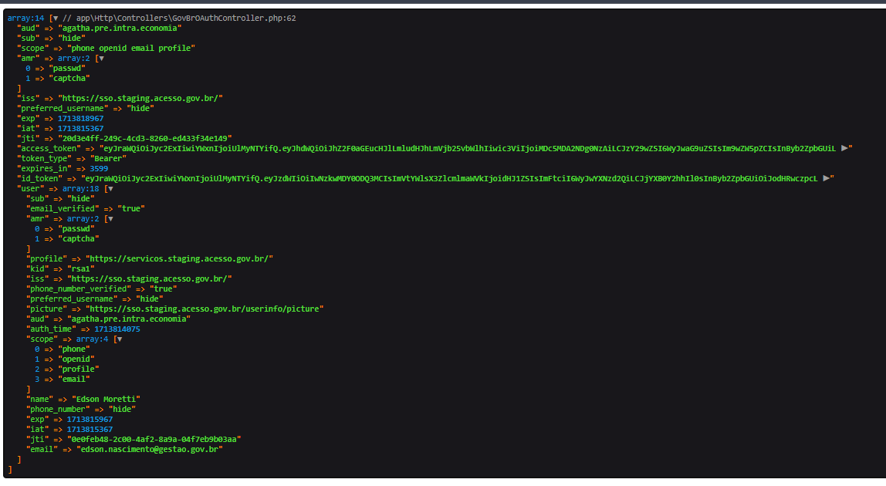

## Exemplo Simples de Integração com o Login Único do Governo Federal

Roteiro de Integração do Login Único do Governo Federal - Informações Técnicas para Integração
Link: https://acesso.gov.br/roteiro-tecnico/

### Rotas disponíveis

1. `'/'` - Esta rota leva à página inicial do aplicativo. Ela é controlada pelo método `index`
   no `GovBrOAuthController`.

2. `'/oauth/authorize'` - Esta rota é usada para iniciar o processo de autorização OAuth. Ela redireciona o usuário para
   a URL de autorização do provedor OAuth. Esta rota é controlada pelo método `authorizeURL` no `GovBrOAuthController`.

3. `'/gestaoriscos/api/login/openid'` - Esta rota é usada como URI de redirecionamento após a autorização bem-sucedida
   do OAuth. Ela é responsável por obter o token de acesso usando o código de autorização recebido. Esta rota é
   controlada pelo método `getToken` no `GovBrOAuthController`.

### Controladores e Serviços

O `GovBrOAuthController` é o controlador principal que gerencia as rotas acima. Ele usa o serviço `GovBrAuthService`
para interagir com o provedor OAuth.

O `GovBrAuthService` é responsável por construir as URLs de autorização e logout, obter o token de acesso e validar a
configuração do OAuth.

Para mais detalhes, consulte o código-fonte dos arquivos `GovBrOAuthController.php` e `GovBrAuthService.php`.
